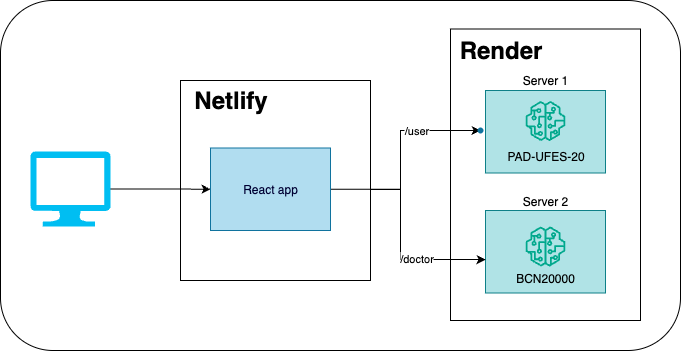

# siads-699-team-18-frontend
Project for Fall '25 University of Michigan MADS Capstone Team 18

Team members:
- Samantha Roska
- Sawsan Allam
- Andre Luis Camarosano Onofre

## Discliamer

This application is not intended to replace professional medical advice, diagnosis, or treatment. Always seek the guidance of your physician or other qualified health care provider with any questions you may have regarding a medical condition.

## About the project
Skin cancer is a growing global health concern, with rising incidence rates and limited access to early diagnostic services in many regions- for example melanoma accounts for around 75% of skin cancer-related deaths (Didier et al., 2024). Timely detection is essential, as early-stage skin cancers are highly treatable, decreasing healthcare costs and improving health outcomes. Traditional diagnostic methods rely on specialist expertise and dermatoscopic imaging, which are often scarce in low-resource or remote settings. Advances in deep learning offer promising solutions by enabling automated classification of skin lesions from image data, potentially bridging these gaps. 

This motivated our proposal to develop and evaluate machine learning models that can distinguish cancerous vs. benign skin lesions, leveraging publicly available dermatoscopic and smartphone-based datasets. We propose two complementary models: one for healthcare providers, designed to analyze dermatoscopic images, and another for the general public, enabling classification of smartphone-captured images via a mobile-friendly web application inspired by the real-time mobile performance demonstrated by Oztel et al. (2023). This dual approach supports both professional diagnostics and early self-assessment, potentially prompting more timely medical consultations

## Application Architecture



This repo is 1 of 3 repos used to make this application live. This repo focuses on the front-end code required for the users interaction with our application. The use of 3 repos is because our application requires the use of two models. One model for users using phone images and the other model is for doctors using dermatoscopic images. Processing for these models varied slightly, but we felt it important to keep the code for the models separate in order to adhere to single responsibility.

Repos used to make this application:
- UI: https://github.com/samroska/siads-699-team-18-frontend
- Users Service: https://github.com/samroska/siads-699-team-18-service
- Doctors Service: https://github.com/samroska/siads-699-team-18-service-2

### Key Features

#### User Portal
- Phone image upload and analysis
- Simplified probability visualization
- Educational information about skin conditions

#### Doctor Portal
- Dermatoscopic image upload and analysis
- Detailed probability breakdowns with medical terminology
- Advanced visualization tools

#### Shared Features
- **Privacy-First Design**: No image storage, temporary processing only
- **Responsive UI**: Mobile and desktop optimized
- **Real-time Processing**: Immediate results with loading states
- **Educational Content**: Detailed information about skin conditions
- **Medical Disclaimers**: Clear warnings about preliminary nature of predictions

### Security & Privacy
- **No Data Persistence**: Images processed in memory only
- **No User Tracking**: No personal data collection
- **Secure API Calls**: HTTPS endpoints with proper error handling
- **Medical Compliance**: Clear disclaimers about not replacing medical advice

### Deployment
- **Frontend**: Deployed on Netlify.com
- **Backend Services**: Deployed on Render.com
- **Environment**: Production endpoints configured for live use

This architecture ensures scalability, maintainability, and clear separation of concerns between user types while maintaining a consistent user experience across both portals.


## Getting Started

Follow these steps to set up and run the application locally:

### Prerequisites
- Node.js (v18 or newer recommended)
- npm (comes with Node.js)

### Installation
1. Clone the repository:
    ```bash
    git clone https://github.com/<your-org>/siads-699-team-18-frontend.git
    cd siads-699-team-18-frontend
    ```
2. Install dependencies:
    ```bash
    npm install
    ```

### Running the Application
Start the development server:
```bash
npm run dev
```
This will launch the app at [http://localhost:5173](http://localhost:5173) (default Vite port).

### Usage
1. Open your browser and go to [http://localhost:5173](http://localhost:5173).
2. Choose your role (User or Doctor) on the landing page.
3. Upload an image and view the results.

- you can find dermatoscopic images [here](https://challenge.isic-archive.com/landing/milk10k/)
- you can find phone images [here]()

### Project Structure
- `src/` - Main source code (components, styles, etc.)
- `public/` - Static assets
- `index.html` - Main HTML file
- `package.json` - Project dependencies and scripts

### Additional Notes
- The backend service must be running and accessible for predictions to work.
- If you encounter issues, ensure your Node.js and npm versions are up to date.
- There are two service repos associate with this project 
   - Service One Repo is for User cellphone images : 
       - https://github.com/samroska/siads-699-team-18-service
   - SERVICE Two Repo is for Doctor dermatoscopic images
       - https://github.com/samroska/siads-699-team-18-service-2

### Finding Images

You can find images for dermatoscopic imput [here]()


### Contributing
1. Fork the repository and create a new branch for your feature or fix.
2. Make your changes and commit with clear messages.
3. Push your branch and open a pull request.

### Contact
For questions or help, contact the project maintainers or open an issue in the repository.

### AI usage
This application was built with help from Microsoft copilot 
